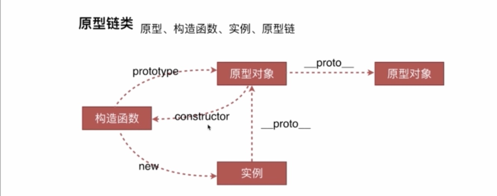
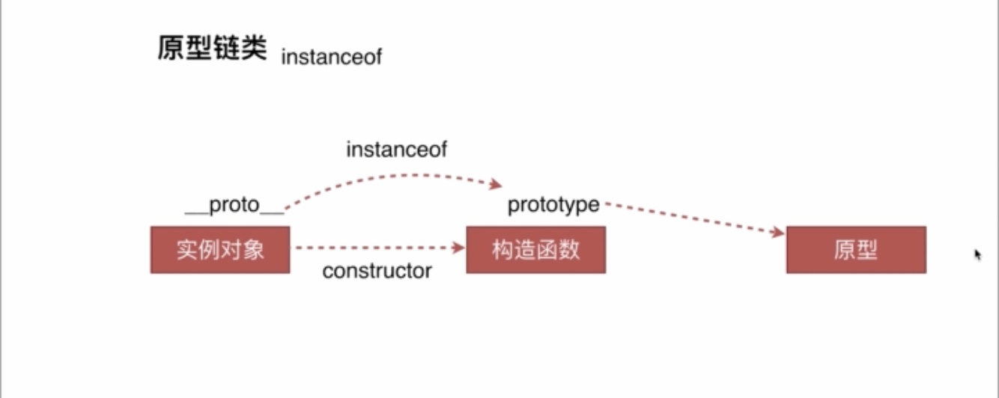

# Javascript 面向对象之原型与继承

> 在 Javascript 中，面向对象之继承的特性是通过什么实现的？

## 原型

> 在 JS 的世界里，除了内置基础类型，其他都是对象，函数也是对象。

普通对象有`__proto__`，标识此对象是从什么原型生成的。

只有函数有 prototype，标识这个函数的原型。可以理解函数是一个抽象对象，普通对象可以通过函数创建出来（new）出来。

JS 世界里的祖先对象就是 Object，所有对象都根据 Object 派生出来。

### 原型的特点

1. 原型是一个抽象对象，可以类比为 Java 语言里面的 class;
2. 函数在声明的时候，JS 引擎会给这个函数自动加上原型 prototype;
3. 原型包含构造函数和它自己所继承的原型对象`__proto__`;
4. 函数的原型的构造函数就是函数本身。`F.prototype.constructor === F`;
5. 通过函数 new 出来的实例，实例对象的原型为函数的原型 `o.__proto__ === F.prototype`;

## 原型链



### instanceof 的原理



实例对象.`__proto__` === 构造函数.prototype。

`instanceof`缺点：无法区分对象是由哪个原型直接派生的。因为只要是原型链上的原型，都会返回 true。

可以通过实例对象的`o.__proto__.constructor === F`来判断是否由哪个函数直接创建。

```js
console.log(o3 instanceof Object); //true
// instanceof 等价于下面
console.log(o3.__proto__ === M.prototype); // true
console.log(o3.__proto__ === Object.prototype); // true
console.log(o3.__proto__.constructor === M); // true
console.log(o3.__proto__.constructor === Object); // false
```

## 继承

> 继承的本质就是实现代码重用和数据共享。

在 JS 语言，继承的意义是，子类要共享父类的属性和方法。
