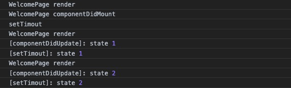

## React 是什么？
1. UI框架, 视图层框架；
2. React编程思想: UI组件化，all in JS(css, picture, html all import in js)，响应式编程框架；
3. 包含React.js / React Native / React VR(360)；
4. 函数式编程：便于单元测试；
5. Facebook 2013年开源；
6. React Fiber： React@16 非常重要的，具有里程碑意义的React版本；
7. React 设计理念包含很重要一条：all in js，css文件可以import到js文件里， 图片也可以import到js文件里；
8. React是声明式的开发方式：
    > Jquery 就是命令式的开发方式，React只需要去关注数据，数据构建好了，React框架会自动去渲染dom。
9. 可以与其他框架并存，React只是一个视图层框架，复杂应用还需要引入其他数据框架。
10. 单向数据流：父组件可以向子组件传递数据，子组件只能去使用父组件数据(Read-only)，不能改变父组件数据；
11. react只支持IE8以上的浏览器；

## React 脚手架工具
脚手架工具，前端工程化  
脚手架工具：webpack，gulp，grunt，yarn(基于node，npm/yarn)  
react脚手架工具：webpack  
Create-react-app 脚手架工具也是通过webpack实现的，适合新手  
Create-react-app 创建的项目默认不支持less编译，生成的项目文件，默认看不到  webpack配置
    > 暴露webpack配置文件： `npm run eject`

## React 编程思想

### UI组件化-利于代码复用
- JSX:  把HTML模板嵌入到JS中 (import react 用于编译JSX)
        HTML模板中嵌入JS表达式需要加{} 花括号， 同理注释也用花括号{/**/}；  
- ES6:  实现JS语言OOP的封装，实现UI组件化 (Component)；  
- JSX 语法：包裹的HTML模板必须有一个顶层元素，否则报错；React@16 Fragment 占位符：React@16 也就是React Fiber版本推出Fragment占位符，使得HTML模板可以去掉顶层元素，布局更加灵活

### 响应式设计思想
传统的web编程中，更新UI界面的方式是通过直接操纵Dom，来Dom的内容和样式；
React的设计思想和传统web编程的思想是完全不同的，React是一个响应式的框架，它强调的是不要直接操纵Dom；
我们直接操纵数据；通过数据的变化，React会自动感知到数据的变化，自动生成新的Dom；
对于React开发者来说，我们只需要关注数据层的操作就可以了。
React更新UI界面的方式：Dom节点和数据对象之间建立了一个绑定关系，只需要关注数据对象的变化，Dom界面会被动更新；

## React 渲染原理
数据发生变化，render函数会重新执行

JSX -> JS 对象(虚拟dom) -> 真实DOM

### 最早Web开发更新界面方式：
1. 数据发生变化；
2. 获取真实Dom节点；
3. 用新生成Dom替换原来的Dom；

### 加入字符串模板的更新方式：
1. 数据Data + 模板 结合 -> 生成真实Dom
2. 数据变化之后，主动更新；
3. 数据 + 模板 结合，生成新的模板字符串，存储在DocumentFragment中
4. 通过innerHTML挂载到真实Dom上；

### React更新界面方式：

1. 初始化：state 数据 + JSX模板 结合
2. 生成虚拟Dom -> 挂载到真实Dom
3. state 数据变化，render函数回调（被动更新，无需开发者关注）
4. 生成新的虚拟Dom
5. 比较原始虚拟Dom和新的虚拟Dom的区别（React Diff 算法）
6. 只更新变更的Dom节点的内容  

### react key和diff机制
react的组件diff机制是基于Tree Diff策略，对树进行分层比较（dom跨层级移动操作特别少）。对于同一层级的一组节点，它们可以通过唯一id进行区分。
React只会简单的考虑同层级节点的位置变换，而对于不同层级的节点，只有创建和删除操作；

在开发组件时，保持稳定的DOM结构会有助于性能的提升。

## React 生命周期 (based on React v15)

1. 初始化阶段：
   - constructor 构造函数
   - getDefaultProps 获取props默认值
   - getDefaultState 获取state默认值

2. 挂载阶段：
    - componentWillMount (React v16 弃用， 改用static getDerivedStateFromProps(props, state)) 
    - render
    - componentDidMount

3. 更新阶段
    - componentWillReceiveProps (React v16弃用）
    - shouldComponentUpdate
    - componentWillUpdate (React v16弃用）
    - render
    - componentDidUpdate

4. 卸载阶段
     - componentWillUnmount

## React 生命周期 (based on React v16)

1. 初始化阶段：
    - constructor 构造函数；
    - getDefaultProps
    - getInitialState 
2. 挂载阶段：
    - static getDerivedStateFromProps(props, state)
    - render
    - componentDidMount
3. 更新阶段：
    - static getDerivedStateFromProps(props, state)
    - shouldComponentUpdate
    - render
    - getSnapshotBeforeUpdate(preProps, prevState)
    - componentDidUpdate
4. 卸载阶段：
    - componentWillUnmount
5. 错误处理：
    - componentDidCatch

## react事件机制
React事件并没有绑定在真实的Dom节点上，而是通过事件代理，在最外层的document上对事件进行统一分发，通过`dispatchEvent`循环调用所有层级的事件来模拟事件的冒泡和捕获。

### React 合成事件 - SyntheticEvent
DOM上绑定了过多的事件处理函数，整个页面响应以及内存占用可能会受到影响。React为避免这类DOM事件滥用，同时屏蔽底层不同浏览器之间的事件系统差异，实现了一个中间层SyntheticEvent，叫合成事件。

React根据W3C规范定义了每个事件处理函数的参数，即合成事件。事件处理程序将传递SyntheticEvent的实例，这是一个跨浏览器原生事件的包装器。它具有与浏览器原生事件相同的接口，包括`stopPropagation()`和`preventDefault()`，在所有浏览器中具有相对统一的工作方式。

React合成的SyntheticEvent采用了事件池，这样做可以大大节省内存，而不会频繁的创建和销毁事件对象。另外，不管在什么浏览器环境下，浏览器会将该事件类型统一创建为合成事件，从而达到了浏览器兼容的目的。
```jsx
<div onClick={this.onClick}>
    react事件
</div>
```
React并不是将click事件绑在该div的真实DOM节点上，而是在document处监听所有支持的事件，当事件发生并冒泡至document处，React将事件内容封装并交由真正的处理函数运行。


### 为什么React合成事件需要绑定this?
在react源码中，当具体到某一事件处理函数将要调用时，将调用`invokeGuardCallback`方法，`invokeGuardCallback`方法里的事件处理函数是直接调用的，并没有指定调用的组件，所以必须在定义callback时手动bind this，否则将不准确。

### 在React中使用原生事件
虽然react封装了几乎所有的原生事件，但是需要考虑到和其他非react第三方库合用的情况，引入一些以原生事件实现的第三方库，并且相互之间需要有交互等场景时，不得不使用原生事件来处理业务逻辑。
由于原生事件需要绑定在真实DOM上，所以一般是在**componentDidMount阶段 / ref的函数执行阶段**进行绑定操作，在**componentWillUnmount阶段**进行解绑操作以避免内存泄漏。

### React事件和原生事件的执行顺序
React的所有事件都是通过document进行统一分发，当真实Dom触发事件后冒泡到document后才会对React事件进行处理。所以目标节点上的Dom原生事件会先执行，然后再执行React合成事件。**如果在原生事件中执行了`stopPropagation`方法，则会导致其他React事件失效。**合成事件的监听器是统一委托注册在document上的，仅在冒泡阶段。所以原生事件的监听器响应总是比合成事件的监听早。
阻止原生事件的冒泡后，会阻止合成事件的监听执行。

### React合成事件与原生事件的区别
- React合成事件使用驼峰命名，而不是全部小写；
- 通过JSX，传递一个函数作为事件处理程序，而不是一个字符串（原生事件是传递一个字符串）；
- React合成事件不能通过返回false来阻止默认行为，必须明确调用`preventDefault`。


## 探究setState执行的机制

### 在React钩子函数和React合成事件中的setState
```js
    // state = { index: 0 } in contructor
    componentDidMount() {
        console.log(WelcomePage.pageName, 'componentDidMount');
        /**
         * 在合成事件和钩子函数中调用setState
         */
        this.setState({
            index: this.state.index + 1
        })
        console.log('[componentDidMount]: state', this.state.index);

        this.setState({
            index: this.state.index + 1 // 执行了两次setstate只有一次生效
        })
        console.log('[componentDidMount]: state', this.state.index);
    }

    componentDidUpdate() {
        console.log('[componentDidUpdate]: state', this.state.index);
    }
```
> 这段代码将怎么打印？


1. 调用setState后，立即读取state里的属性，state不会立即更新；
2. 当前组件didmount后，父组件didmount，直到所有组件完成一次更新，然后state里的属性才会真正更新；
3. 更新时会把整条链路上的每个组件的更新合并，每个组件只会触发一次更新的生命周期；

在react生命周期和合成事件中，react仍然处于他的更新机制中，这时无论调用多少次setState，都不会执行更新，而是将要更新的state存入一个暂存队列中，等到最顶层的组件完成didmount或didupdate之后，将统一执行之前所积累的队列中的setState。

**setState是同步的还是异步的？**
由执行机制来看，setState本身不是异步的，而是如果在调用setState时，如果react正处于更新过程中，当前更新会被暂存，等上一次更新执行后再执行，**这样的机制可以确保组件不会被多次重复渲染。**

### React组件在异步函数和原生事件中的setState
```js
    componentDidMount() {
        console.log(WelcomePage.pageName, 'componentDidMount');
        /**
         * 在异步函数和原生事件中调用setState
         */
        setTimeout(() => {
            console.log('setTimout');
            this.setState({
                index: this.state.index + 1
            })
            console.log('[setTimout]: state', this.state.index);
            this.setState({
                index: this.state.index + 1
            })
            console.log('[setTimout]: state', this.state.index);
        }, 0);
    }
    componentDidUpdate() {
        console.log('[componentDidUpdate]: state', this.state.index);
    }
}
```
> 这段代码将怎么打印？



根据JS的event loop的事件模型，原生事件和异步调用（包括http请求，setTimeout等函数）属于宏任务（也叫异步任务），其他同步的代码执行属于微任务（也叫同步任务）。

所以，根据Javascript代码的执行机制，会将异步任务先暂存起来，等所有同步代码执行完毕后再执行，这时上一次更新过程已经执行完毕了，这时在异步任务里调用setState，会立即执行更新，并拿到最新更新的结果。

### 为什么有时连续调用两次setState只有一次生效？
setState 第一个参数支持传入一个对象或者一个函数，第二个可选参数可以传入一个callback，在setState成功之后执行。

```js
    componentDidMount() {
        console.log(WelcomePage.pageName, 'componentDidMount');
        /**
         * 在合成事件和钩子函数中调用setState
         * 为什么两次setState只有一次生效了？
         */
        this.setState({
            index: this.state.index + 1
        }, () => {
            console.log('[componentDidMount]: state 222', this.state.index);
        })
        console.log('[componentDidMount]: state 111', this.state.index);

        this.setState({
            index: this.state.index + 1
        }, () => { // 传入callback, setState成功后回调
            console.log('[componentDidMount]: state 444', this.state.index);
        })
        console.log('[componentDidMount]: state 333', this.state.index);
    }
```

```js
    componentDidMount() {
        console.log(WelcomePage.pageName, 'componentDidMount');
        this.setState( preState => ({ // setState 第一个参数传入一个函数
            index: preState.index + 1
        }), () => {
            console.log('[componentDidMount]: state 222', this.state.index);
        })
        console.log('[componentDidMount]: state 111', this.state.index);

        this.setState( preState => ({
            index: preState.index + 1
        }), () => { // 传入callback, setState成功后回调
            console.log('[componentDidMount]: state 444', this.state.index);
        })
        console.log('[componentDidMount]: state 333', this.state.index);
    }
```

1. 直接传递对象的setState会被合并成一次；
2. 使用函数传递的setState不会被合并；

根据react源码查看setState合并机制：
```js
_assign(nextState, typeof partial === 'function' ? partial call(inst, nextState, props, context) : partial);
```
如果传入的是对象，很明显会被合并成一次，如果传入的是函数，函数的参数preState是前一次合并后的结果，不会被合并。

### 总结 - 最佳实践
1. 不推荐直接在`componentDidMount`里直接调用setState（源自官方文档）。原因是，在componentDidMount中，可以立即调用setState()，会触发一次额外的渲染，但是它将在浏览器刷新屏幕之前发生。也就是说，**在componentDidMount中直接调用setState很可能会造成界面的卡顿和丢帧，会导致一些性能问题。** 推荐，在constructor中使用赋值初始态来替代。
2. 不能在`componentWillUpdate` 和 `componentDidUpdate` 这两个生命周期中不能调用setState，会造成死循环，导致程序崩溃。
3. react会对多次连续的setState（参数为对象）进行合并，如果你想立即使用上次setState后的结果进行下一次setState，可以让setState接收一个函数而不是一个对象。这个函数用上一个state作为第一个参数，将此次更新时的state作为第二个参数。

源自此文章：https://mp.weixin.qq.com/s/vDJ_Txm4wi-cMVlX5xypLg

