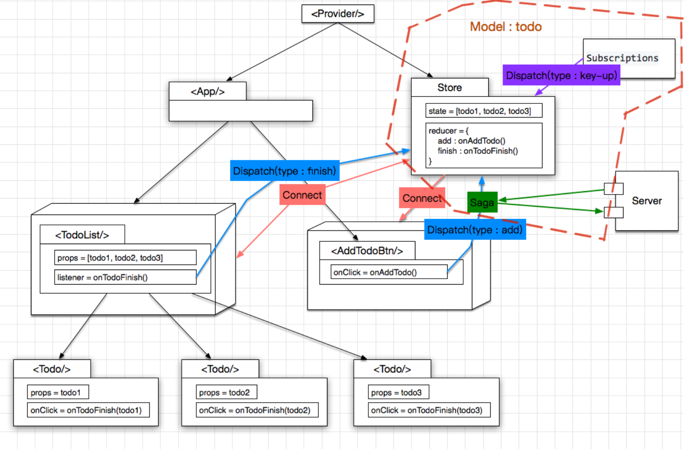

# 深入理解基于React组件间通信方式和数据流管理

## 前言
基于react数据流解决方案已经是一个老生常谈的问题了，在前端已经是非常成熟的领域了。然而，作为一个专业的技术人员，知其然，必须知其所以然，在理解**what to do**，到达**how to do**，必须进入到**why to do**的领地，才能充分理解前端诸多框架本身原理。否则，在不知道开发的应用是如何工作的情况下，很容易给项目带来低质量的代码，进而影响整个项目的可维护性和稳定性。


## 集团前端技术栈
集团前端技术栈简单来说包括三大块：
- 前端设计模式库（Design Pattern Library, DPL)，蚂蚁的Antd和淘系的Fusion Design；
- 统一脚手架工具，蚂蚁的bigfish和淘系的def；
- 数据流管理框架DvaJS，基于redux+redux-saga来管理数据流；

而蚂蚁的开源的UmiJS统一开发框架基本上整合了antd+bigfish+DvaJS一整套工具，使得开发人员在不需要知道框架原理和底层细节的情况下也能快速上手开发。
但是追根溯源，底层都需要涉及到react框架的使用，webpack工程化和基于redux及其中间件的数据流的使用。

## React组件的数据流方案
总体来说，react组件间通信大体可以分为三种方案：
1. 传参props：用于父子组件通信；
2. 使用react提供的context api：用于全局状态的维护；
3. 使用第三方的数据流框架：Redux, Mobx等；

## 父子组件通信 - Props
父组件向子组件传递数据：通过props属性来传递，子组件通过`this.props.data`来读取；
子组件向父组件传递数据：子组件通过传递参数给父组件props绑定的方法来向父组件传递数据，`this.props.Func(data1, data2, ...)`;

组件的props： 用于父子组件之间的数据传递  
state：负责存储组件里面的数据 ;
setState方法：改变数据，数据变化需要深拷贝deepclone  
组件元素的事件绑定: onXXXX.bind(this) 改变事件函数的作用域

> {/*dangerouslySetInnerHTML  不转义html， 但是可能会存在xss攻击风险，如果有此需求，可以用dangerouslySetInnertHTML实现*/}

> React 关于数据变化的设计思想：immutable，state 不允许我们做任何改变，改变使用深拷贝，否则会影响react的性能优化。

## 使用React提供的context api
Context是React提供的一种组件树”全局“通信方式。从v16.3.0开始，React开始提供官方的context接口；
一个使用react context api例子：https://codesandbox.io/s/react-context-api-demo-vz8vm

### React.createContext
每个Context对象包含一个Provider的React组件，允许consumer组件来订阅context的改变。
```js
const AppContext = React.createContext();
```

```js
const { Provider, Consumer } = React.createContext(defaultValue);
```

### Provider组件
Context的Provider接受一个value属性来传递参数。**当value的属性发生变化时，所有作为Provider后代的consumer组件都会被重新渲染。
并且不受`shouldComponentUpdate`方法的约束。**

```js
<AppContext.Provider value={{
    state: this.state,
    actions: this.actions}}>
    <div className="App">
        <AsyncRoute />
    </div>
</AppContext.Provider>
```

### Consumer组件
使用高阶组件重构Consumer组件；
```js
const WithContext = (Component) => {
    // 返回一个functional的组件
    return (props) => (
        <AppContext.Consumer>
            {
                ({ state, actions }) => {
                    return <Component {...props} 
                                data={ state } 
                                actions={ actions } />
                }
            }
        </AppContext.Consumer>
    )
}
```

## 使用Redux框架管理数据流


Redux把所有的数据放到store里面做统一管理，组件去监听store里面的数据的变化。某个组件改变了store里的数据，其他组件都能收到消息。

Redux = Reducer + Flux

### Redux的设计理念


> Redux + Redux-thunk / Redux-Saga + immutable + React-Redux 一整套插件来实现

redux主要由三部分组成：store, reducer, action。

store是一个对象，代表**单一数据源且是只读的**，action是一系列操作的集合，可以通过actionCreator创建。reducer是一个纯函数，通过preState和action携带的数据生成新的state。

### Redux 运行流程
1. dispatch -> action;
2. reducer function call;
3. subscribe state change;
4. store.getState;

### store

#### createStore
`store`实例对象可以通过`createStore()`方法创建，接受三个参数：(后两个参数非必须)
1. reducer: 经过`combineReducers`合并的`reducer`;
2. preloadedState: `state`的初始状态；
3. enhancer: 改变`dispatch`的中间件；
    
> enhancer 是一个组合store creator的高阶函数，返回一个新强化过的store creator。

```js
import {createStore, combineReducers, applyMiddleware} from 'redux';
import * as home from './home/reducer';
import * as production from './production/reducer';
import thunk from 'redux-thunk';

let store = createStore(
    combineReducers({...home, ...production}),
    applyMiddleware(thunk)
);

export default store;
```

```js
import { createStore, applyMiddleware, compose } from 'redux';
import reducer from './reducer';
import thunk from 'redux-thunk';

const composeEnhancers = window.__REDUX_DEVTOOLS_EXTENSION_COMPOSE__ || compose;

const store = createStore(
    reducer, 
    composeEnhancers(applyMiddleware(thunk))
);

export default store;
```

在`createStore`方法中可以使用`middleware`中间件对`action`进行改造。比如redux-thunk和redux-saga对dispatch进行改造，改造之前action函数只能返回对象，改造之后action函数可以返回一个函数，使得action成为高阶函数。

#### dispatch
`store`是一个对象，使用`dispatch` 方法分发`action`，当调用`dispatch(action)`的时候会立即触发`reducer`函数的执行。

#### subscribe
`store`的`subscribe`方法可以监听state的变化，此函数在store调用dispatch的时候会注册一个listener监听state变化，它返回一个函数，调用这个返回的函数可以注销监听。

```js
    componentDidMount() {
        console.log('componentDidMount');
        this.unsubscribe = store.subscribe(() => {
            this.setState(store.getState());
        });
    }

    componentWillUnmount() {
        console.log('componentWillUnmount'); 
        // 在组件unmount的时候把store的监听取消掉，防止memory leak
        this.unsubscribe();
    }
```

#### getState
`getState`方法用于获取store中state数据。

`getState`主要用在两个地方：
    1、store通过dispatch方法分发了action之后，需要通过getState获取store中的数据，并把这个数据传给reducer，这个过程是自动执行的；
    2、组件利用store的subscribe方法监听到state发生变化后调用它来获取新的state数据；

### action 与 actionCreator
`action`用于描述操作和携带操作产生的数据，本质是一个实例对象，actionCreator是action的生成工厂。

### reducer 与 combineReducer
`reducer`是一个函数，必须是一个纯函数，没有副作用， 可以理解为一个记录了所有操作的账本。

`combineReducer`函数用于合并reducer账本。

## React-Redux - 连接React和Redux的桥梁
使用React-Redux库可以优雅而非入侵式的处理Redux管理的数据流业务逻辑。当然，不使用React-Redux库，同样可以使用Redux进行数据流管理，它是非必须的。

React-Redux 将所有组件分成两大类：UI组件（presentational component）和容器组件（container component）;
- UI 组件
1. 只负责UI的呈现，不带有任何业务逻辑；
2. 没有状态（即不使用this.state这个变量），所有数据都有参数this.props提供；
3. 不使用任何Redux的API；

- 容器组件
1. 容器组件：负责管理数据和业务逻辑，不负责UI的呈现；
2. 带有内部状态；
3. 使用Redux的API；

如果一个组件既有UI又有业务逻辑，将它拆分成下面的结构：外面是一个容器组件，里面包了一个UI组件。前者负责与外部通信，将数据传递给后者，由后者渲染出视图。React-Redux规定，所有UI组件都由用户提供，容器组件是由React_Redux自动生成。

>react-redux 7.x 全面拥抱hooks，并且重新回到了基于Subscriptions的实现。使得react-redux 7.x 彻底解决了6.x的性能问题，甚至是所有react-redux中性能最好的。

#### connect()
```js
import { connect } from 'react-redux'
const visibleTodoList = connect(
    mapStateToProps, // 负责输入逻辑，即将state映射到UI组件的参数props
    mapDispatchToProps // 负责输出逻辑，即将用户对UI组件的操作映射成Action
)(TodoList);
```

1. 输入逻辑：外部的数据（即state对象）如何转换成为UI组件的参数；
2. 输出逻辑：用户发出的动作如何变为Action对象，从UI组件传递出去；
3. mapStateToProps会订阅Store，每当state更新的时候，就会自动执行，重新计算UI组件的参数，从而触发UI组件的重新渲染；
4. mapDispatchToProps用来建立UI组件的参数到store.dispatch方法的映射；

#### Provider组件
React-Redux提供Provider组件，可以让容器组件拿到state；Provider在根组件外面包了一层，这样一来，App的所有子组件就默认都可以拿到state了。它的原理是react组件的context属性。

```js
import React, { Component } from 'react';
import AsyncRoute from './router/';
import { Provider } from 'react-redux'
import store from './store'

class App extends Component {
	render() {
		return (
			<Provider store={ store }>
				<div className="App">
					<AsyncRoute />
				</div>
			</Provider>
		)
	}
}
```

## Redux的中间件
Redux本身是无法处理副作用的（Effects），所有对数据流的写入必须同步的，也就是action必须返回一个对象才能把数据带给reducer，否则Redux框架会拦截提示这是一个异步的action。所以需要引入Redux的中间件来处理异步操作。
常用的处理异步操作的中间件有Redux-thunk和Redux-saga。由于DvaJS框架是使用Redux-saga来处理异步操作，所以着重了解Redux-saga的原理。

### Redux-saga

redux-saga是一个用于管理Redux应用异步操作的中间件。redux-saga通过创建Sagas将所有的异步操作逻辑收集在一个地方集中处理，可以用来代替`redux-thunk`中间件。

Sagas是通过Generator函数来创建的。Sagas不同于thunks，thunks是在action被创建时调用的，而Sagas只会在应用启动时调用（但初始启动的Sagas可能会动态调用其他Sagas），Sagas可以被看做是在后台运行的进程，Sagas监听发起的action，然后决定基于这个action做什么：是发起一个异步调用（比如一个fetch请求），还是发起其他的action到store，甚至是调用其他的Sagas。

在redux-saga的世界里，所有的任务都是通过yield Effects来完成的（Effect可以看作是redux-saga的任务单元）。Effects都是简单的Javascript对象，包含了要被Saga middleware执行的信息。

### redux-saga核心API

#### 辅助函数
redux-saga提供一些辅助函数，用来在一些特定的action被派发到store时派生任务。
- takeEvery 
takeEvery允许多个action任务同时启动；
- takeLatest
takeLatest 只允许执行一个action任务，并且这个任务是最后被启动的那个，之前的任务会被取消

#### Effect Creators
redux-saga提供很多创建effect的函数：
- take(pattern)
take阻塞一个effect，监听一个action，直到一个与pattern匹配的action被发起，才会继续执行。
- put(action)
put函数用来发送action的effect，当put一个action后，reducer中就会计算新的state并返回，put是阻塞effect。
- call(fn, ...args)
call函数generator函数，是一个阻塞函数；
- fork(fn, ...args)
fork函数和call函数很像，但fork函数是非阻塞函数；
- select(selector, ...args)
select函数是用来指示middleware调用提供的选择器（函数）获取store上的state数据。类似于store.getState()。

### DvaJS
DvaJS是蚂蚁的数据流框架，蚂蚁的UmiJS和阿里云Xconsole等统一框架都采用DvaJS数据流解决方案。



DvaJS = React-Router + Redux + Redux-saga

## 总结
无论是蚂蚁的前端框架，还是淘系和阿里云的前端框架，都是基于React，React-Router和Redux做的二次封装，减少胶水层代码，使得开发人员更加专注于业务开发本身。只有了解了底层库的基本实现原理，才能更好的了解框架的细节。
针对这些库我基于facebook的create-react-app脚手架做了一个示例工程，把以上提到的这些库通通都使用了一遍，更加能够抽丝剥茧的体会这些库的设计思想和运行原理。
http://gitlab.alibaba-inc.com/dongni.wx/react-redux-data-streaming


React最佳实践：多个component之间发生交互，那么状态就维护在这些Component的最小公约父节点上，即`<App/>`；

`<TodoList />`, `<Todo />`, 以及`<AddTodoBtn />`本身不维持任何state，完全由父节点`<App/>`传入props以决定其展现，是一个纯函数的存在形式，即：`Pure Component`。


React只负责页面渲染，而不负责页面逻辑，页面逻辑可以从中单独抽取出来，变成store。


加入redux-saga，使用Middleware拦截action，异步的网络操作，做成一个Middleware就行。


Dva是基于React+Redux+Saga的最佳实践沉淀。
1. 把store及saga统一为一个model的概念，写在一个js文件里
2. 增加了一个Subscriptions，用于收集其他来源的action，比如键盘操作等；
3. model写法简洁，约定优于配置；