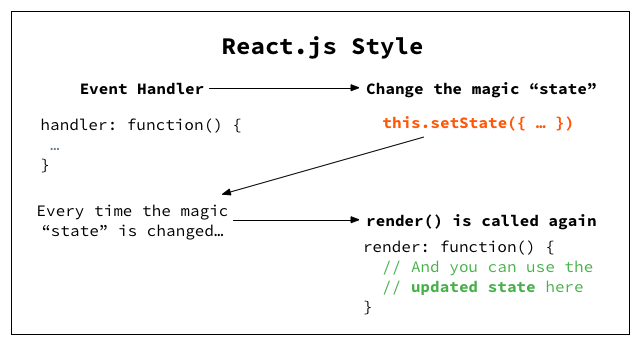
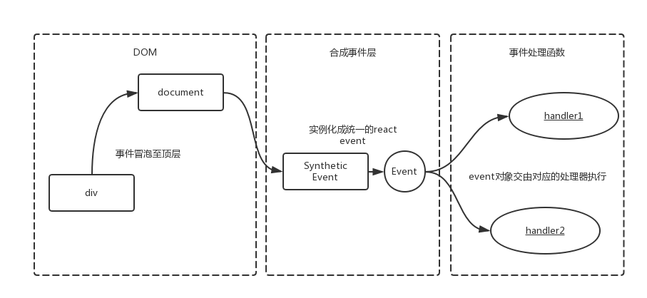

## React 简介
学习react是一个漫长的过程，你会发现它不是一个库，也不是一个框架，而是一个庞大的体系。
### React 是什么？
1. UI框架, 视图层框架；
2. React编程思想: UI组件化，all in JS(css, picture, html all import in js)，响应式编程框架；
3. 包含React.js / React Native / React VR(360)；
4. 函数式编程：便于单元测试；
5. Facebook 2013年开源；
6. React Fiber： React@16 非常重要的，具有里程碑意义的React版本；
7. React 设计理念包含很重要一条：all in js，css文件可以import到js文件里， 图片也可以import到js文件里；
8. React是声明式的开发方式：
    > Jquery 就是命令式的开发方式，React只需要去关注数据，数据构建好了，React框架会自动去渲染dom。
9. 可以与其他框架并存，React只是一个视图层框架，复杂应用还需要引入其他数据框架。
10. 单向数据流：父组件可以向子组件传递数据，子组件只能去使用父组件数据(Read-only)，不能改变父组件数据；
11. react只支持IE8以上的浏览器；

### React 脚手架工具
脚手架工具，前端工程化  
脚手架工具：webpack，gulp，grunt，yarn(基于node，npm/yarn)  
react脚手架工具：webpack  
Create-react-app 脚手架工具也是通过webpack实现的，适合新手  
Create-react-app 创建的项目默认不支持less编译，生成的项目文件，默认看不到  webpack配置
    > 暴露webpack配置文件： `npm run eject`

## React 编程思想
### UI组件化 - 代码拆分设计
- JSX:  把HTML模板嵌入到JS中 (import react 用于编译JSX)
        HTML模板中嵌入JS表达式需要加{} 花括号， 同理注释也用花括号{/**/}；  
- ES6:  实现JS语言OOP的封装，实现UI组件化 (Component)；  
- JSX 语法：包裹的HTML模板必须有一个顶层元素，否则报错；React@16 Fragment 占位符：React@16 也就是React Fiber版本推出Fragment占位符，使得HTML模板可以去掉顶层元素，布局更加灵活

### 响应式设计 - 优化DOM操作
传统的web编程中，更新UI界面的方式是通过直接操纵Dom，来Dom的内容和样式；
React的设计思想和传统web编程的思想是完全不同的，React是一个响应式的框架，它强调的是不要直接操纵Dom；
我们直接操纵数据；通过数据的变化，React会自动感知到数据的变化，自动生成新的Dom；
对于React开发者来说，我们只需要关注数据层的操作就可以了。
React更新UI界面的方式：Dom节点和数据对象之间建立了一个绑定关系，只需要关注数据对象的变化，Dom界面会被动更新；

### 抽象公共组件 - 利于代码复用
抽象公共组件利于代码复用。

## React 渲染机制

1. 初始化：state 数据 + JSX模板 结合
2. 生成虚拟Dom -> 挂载到真实Dom
3. state 数据变化，render函数回调（被动更新，无需开发者关注）
4. 生成新的虚拟Dom
5. 比较原始虚拟Dom和新的虚拟Dom的区别（React Diff 算法）
6. 只更新变更的Dom节点的内容  

### React界面更新方式：
`setState`会触发组件re-render。根据React Diff算法的策略，一般情况下父组件的re-render会导致所有子组件re-render（有些特殊情况不会导致），除非子组件使用`shouldComponentUpdate()`来优化。

另一种例外情况是，如果子组件是`this.props.children`，父组件re-render不会导致子组件re-render。所有嵌套在组件中的JSX结构都可以在组件内部通过`props.children`获取到。

### dangerouslySetHTML
处于安全考虑的因素（XSS攻击），在React当中所有的表达式插入的内容都会被自动转义，就相当于jQuery里面的`text(...)`函数一样，任何的HTML格式都会被转义。直接设置`innerHTML`可能会导致跨站脚本攻击（XSS）。
```jsx
  render () {
    return (
      <div
        className='editor-wrapper'
        dangerouslySetInnerHTML={{__html: this.state.content}} />
    )
  }
```

## React 生命周期 
### based on React v15

1. 初始化阶段：
   - constructor 构造函数
   - getDefaultProps 获取props默认值
   - getDefaultState 获取state默认值

2. 挂载阶段：
    - componentWillMount (React v16 弃用， 改用static getDerivedStateFromProps(props, state)) 
    - render
    - componentDidMount

3. 更新阶段
    - componentWillReceiveProps (React v16弃用）
    - shouldComponentUpdate
    - componentWillUpdate (React v16弃用）
    - render
    - componentDidUpdate

4. 卸载阶段
     - componentWillUnmount

### based on React v16

1. 初始化阶段：
    - constructor 构造函数；
    - getDefaultProps
    - getInitialState 
2. 挂载阶段：
    - static getDerivedStateFromProps(props, state)
    - render
    - componentDidMount
3. 更新阶段：
    - static getDerivedStateFromProps(props, state)
    - shouldComponentUpdate
    - render
    - getSnapshotBeforeUpdate(preProps, prevState)
    - componentDidUpdate
4. 卸载阶段：
    - componentWillUnmount
5. 错误处理：
    - componentDidCatch

## React事件机制
React事件并没有绑定在真实的Dom节点上，而是通过事件代理，在最外层的document上对事件进行统一分发，通过`dispatchEvent`循环调用所有层级的事件来模拟事件的冒泡和捕获。

### React 合成事件 - SyntheticEvent
DOM上绑定了过多的事件处理函数，整个页面响应以及内存占用可能会受到影响。React为避免这类DOM事件滥用，同时屏蔽底层不同浏览器之间的事件系统差异，实现了一个中间层SyntheticEvent，叫合成事件。

React根据W3C规范定义了每个事件处理函数的参数，即合成事件。事件处理程序将传递SyntheticEvent的实例，这是一个跨浏览器原生事件的包装器。它具有与浏览器原生事件相同的接口，包括`stopPropagation()`和`preventDefault()`，在所有浏览器中具有相对统一的工作方式。

React合成的SyntheticEvent采用了事件池，这样做可以大大节省内存，而不会频繁的创建和销毁事件对象。另外，不管在什么浏览器环境下，浏览器会将该事件类型统一创建为合成事件，从而达到了浏览器兼容的目的。
```jsx
<div onClick={this.onClick}>
    react事件
</div>
```
React并不是将click事件绑在该div的真实DOM节点上，而是在document处监听所有支持的事件，当事件发生并冒泡至document处，React将事件内容封装并交由真正的处理函数运行。



### 为什么React合成事件需要绑定this?
在react源码中，当具体到某一事件处理函数将要调用时，将调用`invokeGuardCallback`方法，`invokeGuardCallback`方法里的事件处理函数是直接调用的，并没有指定调用的组件，所以必须在定义callback时手动bind this，否则将不准确。

### 在React中使用原生事件
虽然react封装了几乎所有的原生事件，但是需要考虑到和其他非react第三方库合用的情况，引入一些以原生事件实现的第三方库，并且相互之间需要有交互等场景时，不得不使用原生事件来处理业务逻辑。
由于原生事件需要绑定在真实DOM上，所以一般是在**componentDidMount阶段 / ref的函数执行阶段**进行绑定操作，在**componentWillUnmount阶段**进行解绑操作以避免内存泄漏。

### React事件和原生事件的执行顺序
React的所有事件都是通过document进行统一分发，当真实Dom触发事件后冒泡到document后才会对React事件进行处理。所以目标节点上的Dom原生事件会先执行，然后再执行React合成事件。**如果在原生事件中执行了`stopPropagation`方法，则会导致其他React事件失效。**合成事件的监听器是统一委托注册在document上的，仅在冒泡阶段。所以原生事件的监听器响应总是比合成事件的监听早。
阻止原生事件的冒泡后，会阻止合成事件的监听执行。

### React合成事件与原生事件的区别
- React合成事件使用驼峰命名，而不是全部小写；
- 通过JSX，传递一个函数作为事件处理程序，而不是一个字符串（原生事件是传递一个字符串）；
- React合成事件不能通过返回false来阻止默认行为，必须明确调用`preventDefault`。


