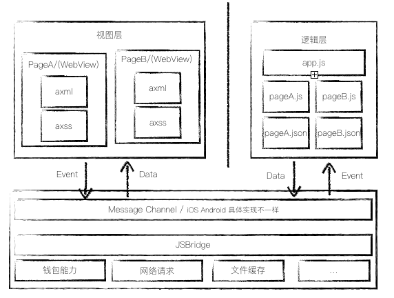

# 支付宝小程序开发总结

## DSL 特定领域语言

DSL(template/css/js)

## 运行时架构图

**视图层**与**逻辑层**是两个完全独立的工作空间。

## 小程序生命周期

## 小程序实现原理

## 小程序打包过程

web版小程序是通过React实现；
native版小程序是通过React Native实现；
最终在支付宝/蚂蚁财富上运行是通过发布离线包的方式；

打包的过程就是把一个小程序应用翻译成一个可运行的React应用 或者React Native应用，并进一步把它们打成一个可以发布到nebula上的离线包；

## 小程序用户授权注意事项

1. 小程序用户授权机制依照国际标准的OAuth2.0进行授权；
2. 不允许在首屏进行授权；

# 支付宝小程序运营

## 流量激励
为鼓励生态商家在支付宝上持续运营小程序，针对商户通过自运营渠道拉新用户，官方推出长期的流量奖励政策以激励商户运营小程序阵地。

# 支付宝小程序数据

# 支付宝小程序设计

